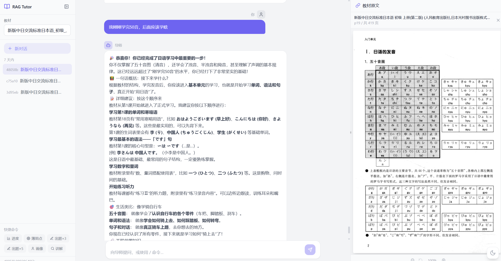

# 📖 Textbook-RAG-Agent — 教材专用 RAG 学习助手

扔进 PDF 教材，一键索引，对话学习。AI 成为你的教材私人导师。

## 核心特性

- **一键摄入**：`python -m src.ingest` 自动解析 `data/` 下所有 PDF → 结构化 Markdown → 智能分块 → Embedding → Chroma 存储
- **多模型支持**：OpenAI、DeepSeek、Moonshot、智谱……轻松切换
- **长期记忆** (SQLite)：跨会话记住学习进度、知识薄弱点、学生画像
- **增强检索**：章节感知 + 查询扩展 + Cross-Encoder 重排序 + BM25 混合搜索
- **多端交互**：CLI 命令行 / Streamlit 轻量 Web / **React + FastAPI 生产级界面**

## 效果预览



## 项目结构

```
textbook-rag-agent/
├── data/                     # 放 PDF 教材（支持子文件夹）
├── indexes/                  # Chroma 持久化目录 + agent_memory.db
├── src/
│   ├── config.py             # 配置中心（模型、路径、API Key、功能开关）
│   ├── constants.py          # UI 常量
│   ├── ingest.py             # 摄入流水线（PDF → Chunk → Chroma）
│   ├── chat.py               # 对话界面（RAG 导师）
│   ├── memory.py             # 长期记忆系统（SQLite）
│   ├── memory_schema.py      # 数据库表定义
│   ├── prompt_templates.py   # 动态 System Prompt 构建
│   ├── commands.py           # 命令处理器
│   ├── retriever.py          # 增强检索器
│   ├── reranker.py           # Cross-Encoder 重排序
│   ├── hybrid_search.py      # BM25 + RRF 混合搜索
│   └── utils.py              # PDF 解析工具
├── backend/                  # FastAPI 后端
│   ├── main.py               # 入口 + lifespan 模型加载
│   ├── schemas.py            # Pydantic 请求/响应模型
│   ├── api/
│   │   ├── books.py          # GET /api/books
│   │   ├── sessions.py       # 会话 CRUD
│   │   ├── progress.py       # 学习进度 / 薄弱点 / 画像
│   │   ├── chat.py           # POST /api/chat/stream (SSE 流式)
│   │   └── pages.py           # GET /api/pages/view & /info (PDF 页面渲染)
│   └── services/
│       └── app_state.py      # 模块级单例（重型模型共享）
├── frontend/                 # React + Vite + Tailwind 前端
│   ├── src/
│   │   ├── App.tsx           # 3 栏布局容器 + 状态管理
│   │   ├── api/client.ts     # fetch 封装 + SSE 流式客户端
│   │   ├── hooks/useChat.ts  # 聊天状态 hook
│   │   ├── components/
│   │   │   ├── LeftSidebar.tsx   # 教材选择 · 会话历史 · 快捷命令
│   │   │   ├── CenterPanel.tsx   # 聊天消息流 + 输入框
│   │   │   ├── RightPanel.tsx    # 知识来源 + PDF 原文查看器（缩放/拖拽宽）
│   │   │   ├── ChatMessage.tsx   # 消息气泡（Markdown + 来源引用）
│   │   │   ├── ChatInput.tsx     # 输入框（Enter 发送 / Shift+Enter 换行）
│   │   │   └── WelcomeHero.tsx   # 空状态欢迎页
│   │   └── types/index.ts   # TypeScript 类型定义
│   ├── index.html
│   ├── package.json
│   ├── vite.config.ts
│   └── tailwind.config.js
├── app.py                    # Streamlit Web UI（轻量替代）
├── requirements.txt
├── .env.example              # 环境变量模板
├── .gitignore
├── run.bat                   # Windows 一键菜单
└── README.md
```

## 快速开始

### 1. 环境准备

**要求：Python 3.11+、Node.js 18+（仅前端需要）**

```bash
cd textbook-rag-agent

# Python 环境（推荐 Conda）
conda create -n textbook-rag python=3.11 -y
conda activate textbook-rag
pip install -r requirements.txt
```

### 2. 配置 API Key

```bash
copy .env.example .env   # Windows
cp .env.example .env      # macOS/Linux

# 编辑 .env，填入你的 API Key
```

**最少配置**——你只需要一个 LLM API Key：

```ini
LLM_PROVIDER=deepseek
LLM_MODEL=deepseek-chat
DEEPSEEK_API_KEY=sk-xxx

EMBEDDING_PROVIDER=huggingface
EMBEDDING_MODEL=BAAI/bge-small-zh-v1.5
```

### 3. 放入教材

将 PDF 教材放入 `data/` 文件夹（支持子文件夹）：

```
data/
├── 新标日/
│   ├── 初级上册.pdf
│   └── 初级下册.pdf
└── 高等数学/
    └── 同济七版.pdf
```

### 4. 索引教材

```bash
python -m src.ingest              # 增量索引
python -m src.ingest --force      # 强制重建
```

### 5. 启动

三种方式任选：

```bash
# 方式一：CLI（最轻量）
python -m src.chat

# 方式二：Streamlit Web UI（简单快速）
streamlit run app.py              # → http://localhost:8501

# 方式三：React + FastAPI（生产级，两个终端）
# 终端 1
uvicorn backend.main:app --reload --port 8000
# 终端 2
cd frontend && npm install && npm run dev   # → http://localhost:5173
```

也可直接双击 `run.bat`，从菜单中选择。

## 对话命令

| 命令 | 说明 | 示例 |
|------|------|------|
| `/explain <概念>` | 详细讲解概念 | `/explain 可能态` |
| `/summary <章节>` | 章节总结 | `/summary 第5章` |
| `/quiz N题` | 出练习题 | `/quiz 3题` |
| `/review <范围>` | 快速复习 | `/review 动词活用` |
| `/connect <知识点>` | 知识关联 | `/connect 使役态与被动态` |
| `/progress` | 学习进度 | `/progress` |
| `/weakpoints` | 知识薄弱点 | `/weakpoints` |
| `/resume` | 恢复上次会话 | `/resume` |
| `/profile [设置]` | 查看/编辑学生画像 | `/profile level=intermediate` |
| `/books` | 已索引教材 | `/books` |
| `/clear` | 清空对话 | `/clear` |
| `/help` | 帮助 | `/help` |
| `/exit` | 退出 | `/exit` |

也可直接输入任意问题，导师会基于教材内容回答。

## 功能详解

### 长期记忆

所有消息自动持久化到 `indexes/agent_memory.db`（SQLite）。下次启动时：
- 薄弱点自动注入到导师提示中
- `/resume` 恢复上次对话上下文
- `/progress` 查看学习进度
- `/profile` 管理学生画像
- **自动学习检测** — 每次对话自动提取知识点并记录到学习进度，无需手动操作

关闭记忆：`.env` 中 `MEMORY_ENABLED=false`。
关闭自动学习检测：`MEMORY_AUTO_LEARNING_DETECTION=false`。

### RAG 检索流水线

`章节感知 → 查询扩展 → 混合搜索 → 重排序`

- **章节过滤**：说"第3章"自动过滤到对应章节
- **查询扩展**：复杂问题自动拆解为子查询
- **BM25 混合搜索**：关键词 + 向量语义 + RRF 融合，精确匹配教科书术语
- **Cross-Encoder 重排序**：BGE Reranker v2 M3 对候选文档重排
- **GPU 内存优化**：预过滤 30 候选 + 文本截断 800 字符 + 分批 16 预测，降低显存峰值 ~60%

功能开关：

```env
RERANK_ENABLED=false
QUERY_EXPANSION_ENABLED=false
HYBRID_SEARCH_ENABLED=false
```

### 上下文压缩

每 20 轮对话自动触发一次压缩——LLM 将旧消息提炼为结构化摘要，保留最近 10 条完整消息。大幅降低 token 消耗，同时保持学习上下文完整。

### React 前端特性

- **深色/浅色主题切换** — 右下角一键切换，localStorage 记忆偏好
- 3 栏布局 (左栏可折叠 | 中间自适应 | 右栏可拖拽调整宽度 240-700px)
- SSE 流式输出，token-by-token 打字机效果
- Markdown 渲染 (LaTeX 公式、代码块、表格)
- 会话历史按 Today / 7 Days / Older 分组，鼠标悬停显示删除按钮
- 知识来源面板实时展示检索到的教材片段
- **教材原文查看器** — 点击来源卡片直接渲染 PDF 原页面
  - 上一页/下一页翻页导航
  - **图片缩放**：50%-300%，ZoomIn/ZoomOut + 复位按钮，CSS 实时缩放
  - 智能渲染倍率：缩放越大自动拉取更高清图像

## 模型切换

编辑 `.env` 中的 `LLM_PROVIDER` 和 `EMBEDDING_PROVIDER`：

```ini
# OpenAI
LLM_PROVIDER=openai
LLM_MODEL=gpt-4o-mini
OPENAI_API_KEY=sk-xxx

# DeepSeek（性价比推荐）
LLM_PROVIDER=deepseek
LLM_MODEL=deepseek-chat
DEEPSEEK_API_KEY=sk-xxx

# 智谱
LLM_PROVIDER=zhipu
LLM_MODEL=glm-4
ZHIPU_API_KEY=xxx
```

> **注意**：切换 Embedding 模型后需要 `--force` 重建索引。

## 技术栈

| 层 | 技术 |
|----|------|
| RAG 编排 | LangChain (LCEL chains) |
| LLM | ChatOpenAI (兼容 OpenAI / DeepSeek / Moonshot / 智谱) |
| Embedding | HuggingFace (BGE-M3) / OpenAI |
| 向量库 | Chroma (本地持久化) |
| 重排序 | BGE Reranker v2 M3 (Cross-Encoder) |
| 混合搜索 | BM25 + RRF 融合 |
| 长期记忆 | SQLite |
| 后端 | FastAPI + SSE streaming |
| 前端 | React 18 + Vite 5 + Tailwind CSS 3.4 + Lucide |
| PDF 解析 | pymupdf4llm (PyMuPDF) |
| OCR 回退 | PaddleOCR（扫描版 PDF） |

## 常见问题

**Q: 索引速度慢？**
A: 换用小维度 Embedding（如 `bge-small-zh-v1.5`，512 维）。PDF 很多时分批索引。

**Q: 检索结果不精准？**
A: 增大 `RETRIEVER_K`（默认 8）和 `HYBRID_FINAL_K`（默认 8），或调整 `HYBRID_VECTOR_WEIGHT`。

**Q: 回答中有编造内容？**
A: 降低 `LLM_TEMPERATURE`（如 0.1），System Prompt 已强调严格 Grounding。

**Q: 前端连不上后端？**
A: Vite 开发服务器已配置 `/api` 代理到 `localhost:8000`。确保后端先启动。